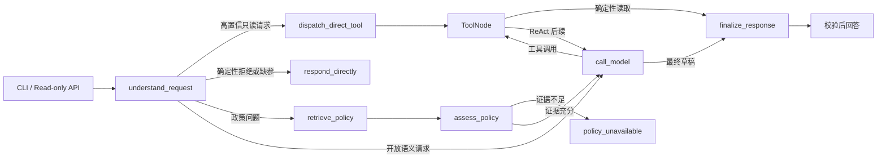

# 客服 Agent 架构与设计决策

## 请求路径

业务订单、物流和申请记录存入 SQLite；对话状态由 LangGraph SQLite Checkpointer
持久化；政策正文与元数据保存在 JSON，归一化向量使用 FAISS `IndexFlatIP`。

## 核心设计决策

1. **LLM 负责语义，服务端负责授权。** 模型结构化输出只提供意图候选，身份、唯一订单、工具白名单和写操作确认均由代码校验。
2. **高置信实体走确定性路由。** 明确订单号、物流号和当前客户订单列表不需要模型再次选工具；缺参时不允许小模型猜值。
3. **检索排序与答案充分性分离。** FAISS 召回和 CrossEncoder 只排序；覆盖守卫、权威 `policy_id` 和独立结构化检查决定证据是否可用。
4. **持久 ID 与展示引用分离。** `chunk_id` 用于索引和溯源；`[Source N]` 仅是单轮 prompt 内的临时标签。
5. **所有写操作 fail-closed。** 申请前重新检查身份、订单、资格、政策版本和确认指纹；interrupt 恢复不会延长确认期限。
6. **最终答案不信任模型草稿。** 工具结果和引用经过 Pydantic/来源校验，再由确定性渲染器输出。

## 适用边界

这是单机、单 worker、合成数据的作品集 MVP。真实生产仍需接入正式认证、密钥管理、
分布式限流、集中式 tracing/metrics、线上数据库、人工客服系统、容量测试和数据治理。
Multi-Agent 未引入，因为当前流程不存在需要自治角色协商的独立业务边界。
